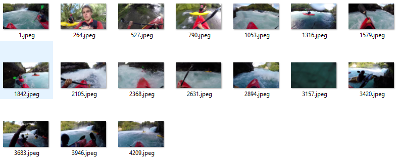
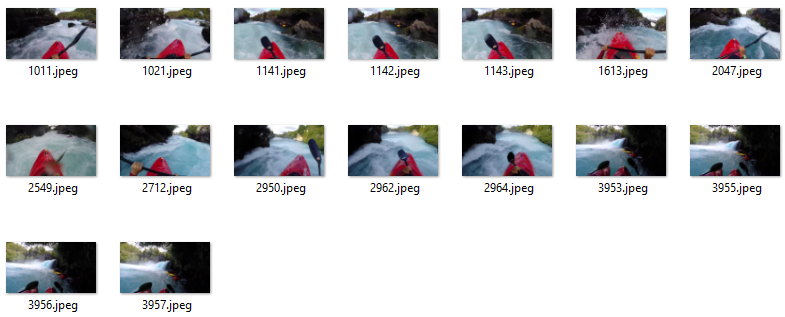
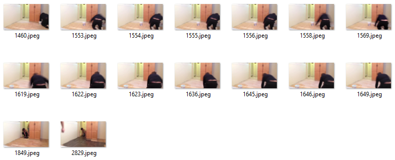

# VideoFrameSampler
Salient Video Frames Sampler for Efficient Model Training Using the Mean of Deep Features  

## Summary
This code's purpose is to find meaningful frames in both trimmed and untrimmed video datasets. And this Sampler working only with UCF101, HMDB51, ActivityNet datasets.  
We only provides video frame sampler codes(returns the JSON file), however, we will be published training codes which utilize this sampler results in another repository later!!.  

## Requirements
*   opencv-python
*   ffmpeg-python
*   torch
*   [pillow-simd(optional)](https://github.com/uploadcare/pillow-simd)

## Usage(UCF101)
Clone this repository
```bash
git clone https://github.com/titania7777/VideoFrameSampler.git
```
Download the dataset
```bash
cd ./VideoFrameSampler/Data/UCF101/
./download.sh
```
Run an Index Sampler
```bash
cd ../../
python sampler_run.py --dataset-name UCF101 --split-id 1
```
Loading Test
```bash
python sampler_test.py --dataset-name UCF101 --split-id 1 --sequence-length 16
```

## Sampled Annotations
We provide our sampler results here
### [Download UCF101 Sampled Annotations](https://www.dropbox.com/s/j4brxpdcqsp848n/ucf101_labels.zip?dl=0)  
### [Download HMDB51 Sampled Annotations](https://www.dropbox.com/s/7r9ouxz9c4ai5ex/hmdb51_labels.zip?dl=0)  
### [Download ActivityNet Sampled Annotations](https://www.dropbox.com/s/hgnruj6vvol2pk1/activitynet_labels.zip?dl=0)  

## Examples on ActivityNet
### Kayaking(Uniform)


### Kayaking(Our)


### Laying Tile(Uniform)


### Laying Tile(Our)

